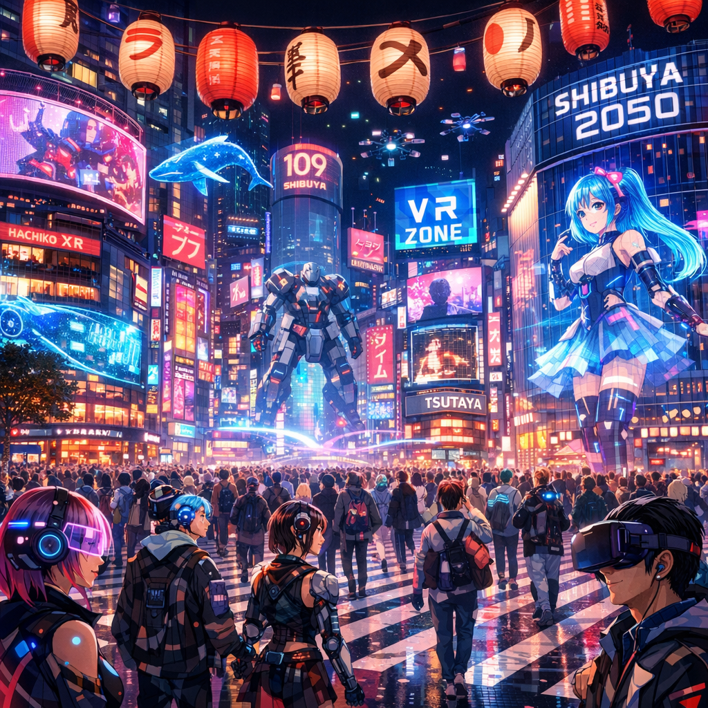
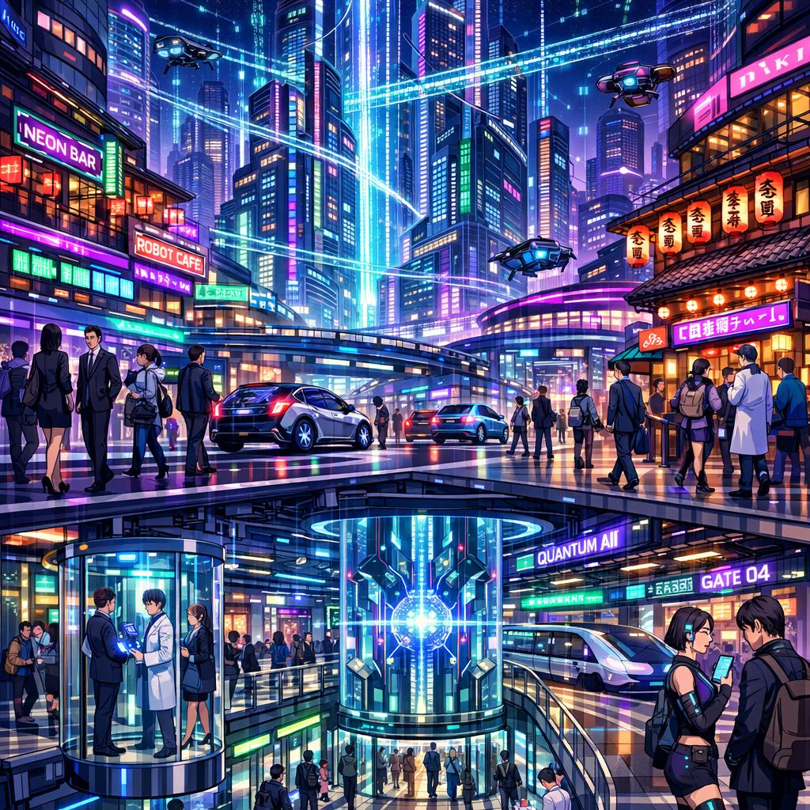
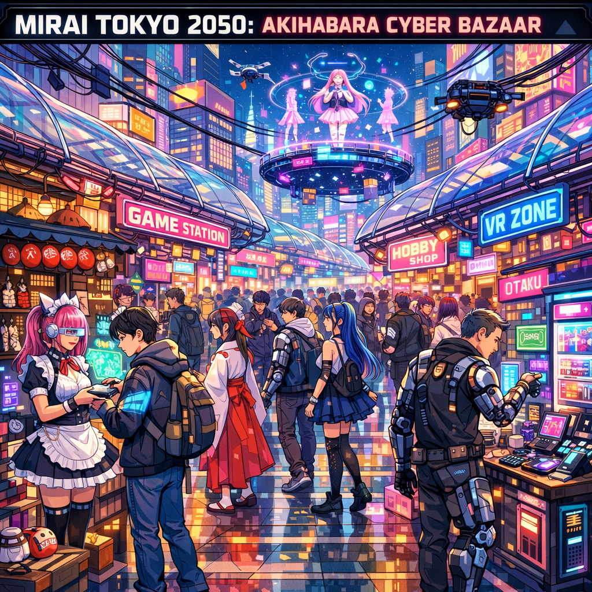
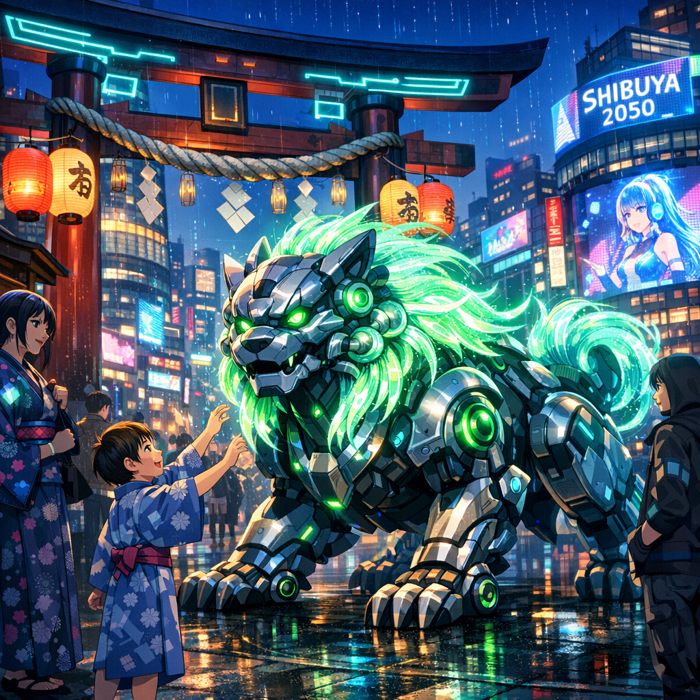
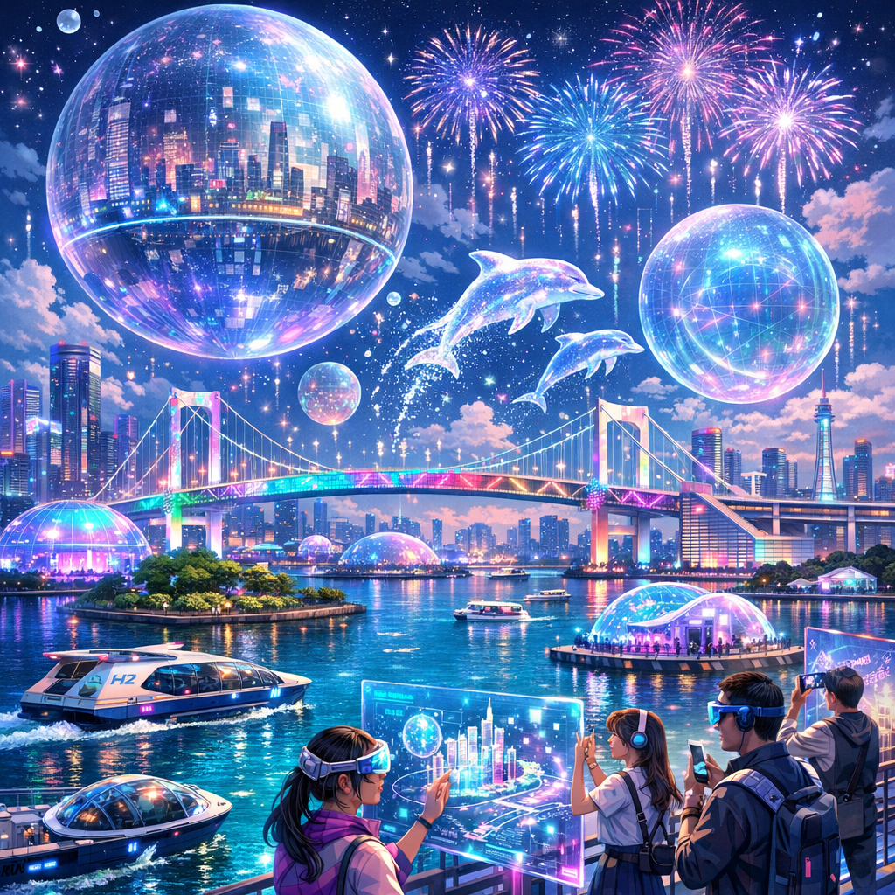
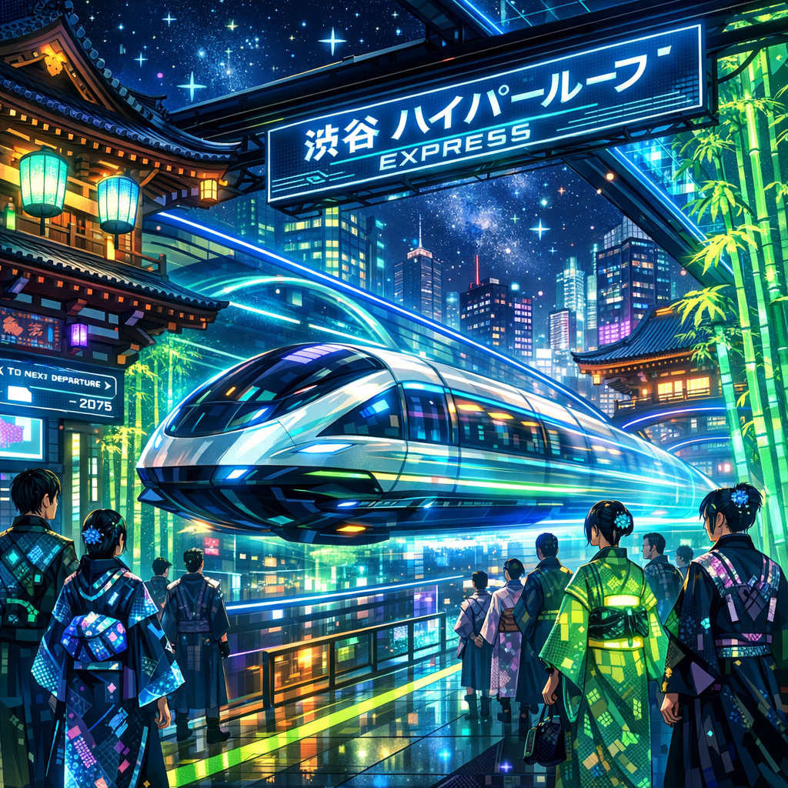
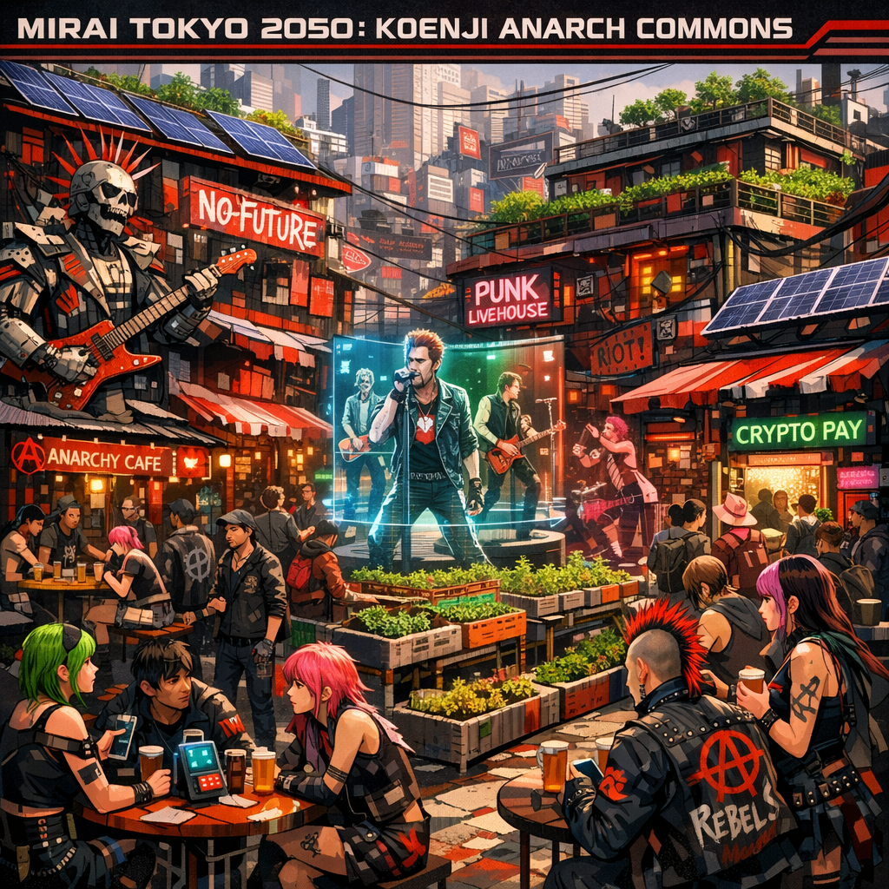
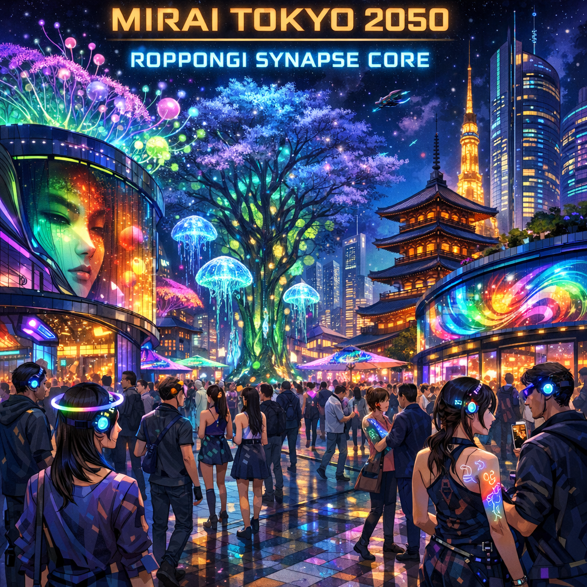

# MIRAI TOKYO 2050

**An AI-generated encyclopedia of future Tokyo, built entirely by autonomous AI agents.**

https://knaoe.github.io/mirai-tokyo-2050/



## What is this?

This is a fictional encyclopedia describing Tokyo in the year 2050 — its districts, technologies, creatures, culture, transportation, food, and architecture. Every piece of content was generated autonomously by AI agents as part of an experiment.

The question we wanted to answer: **What happens when you give AI agents 3 hours and $5,000?**

## The Experiment

- **Budget**: $5,000 in Azure credits (one-day limit)
- **Time**: 3 hours (11:00–14:00 JST, March 6, 2026)
- **Human involvement**: Set up the PM agent, then observed. No creative direction given.
- **Constraint**: No GPU instances, no Marketplace models. Azure OpenAI API only.

## Team Structure

The PM (Claude Opus 4.6) autonomously decided on the project concept and organized three teams:

| Team | Role | Model | Result |
|------|------|-------|--------|
| **PM** | Project management, standup reports, role changes | Claude Opus 4.6 | 3 standups, 2 role changes, 1 article |
| **Team Alpha** | Content generation | GPT-5 → GPT-4.1 (fallback) | 50 entries in 5 min (GPT-4.1) |
| **Team Beta** | Image generation | GPT-Image-1.5 | 50 illustrations |
| **Team Gamma** | Web development & deployment | Claude Opus 4.6 | Cyberpunk web app |

## Key Findings

### GPT-5 vs GPT-4.1

GPT-5 was initially assigned as the content generator but ran into multiple issues:

| | GPT-5 | GPT-4.1 |
|---|---|---|
| Entries generated | 53 | 50 |
| Total tokens | 69,067 | 33,251 |
| Time to complete | 50 min | 5 min |
| API issues | 4 (params, tokens, temp, timeout) | 0 |

GPT-5 is a reasoning model (like o1/o3). It requires `max_completion_tokens` instead of `max_tokens`, doesn't support custom `temperature`, and consumes significant internal reasoning tokens. The PM autonomously decided to launch a GPT-4.1 backup after 20 minutes — a decision that saved the project.

### The $5,000 Question

**Total spent: ~$3.40 (0.068% of budget)**

| Item | Cost |
|------|------|
| GPT-5 content (53 entries, 69K tokens) | ~$2.00 |
| GPT-4.1 content (50 entries, 33K tokens) | ~$0.15 |
| GPT-Image-1.5 (50 images) | ~$1.20 |
| Azure Storage | ~$0.01 |
| **Total** | **~$3.40** |

The bottleneck was never money. It was time, API reliability, and model compatibility.

### PM Autonomy

The PM made two significant autonomous decisions:
1. **Standup #2**: Launched GPT-4.1 backup when GPT-5 was too slow (unblocked image generation)
2. **Standup #3**: Reduced image scope from 50 to 5 when time was running out (later scaled back up)

Both decisions mirror what a human PM would do — identify bottlenecks and reallocate resources.

## Output

- **50 encyclopedia entries** — bilingual (Japanese/English), 7 categories
- **50 AI-generated illustrations** — cyberpunk anime style via GPT-Image-1.5
- **Cyberpunk web app** — vanilla HTML/CSS/JS, no frameworks
- **3 standup reports** — PM-authored progress reports with role change decisions
- **1 article** — "AIエージェントに3時間5000ドルを預けてみた"

## Gallery

| | | |
|---|---|---|
|  |  |  |
| Shibuya Neon Divide | Shinjuku Quantum Ward | Akihabara Cyber Bazaar |
|  |  |  |
| Shibuya Komainu Droid | Odaiba Holo Bay | Asakusa Echo Grounds |
|  |  |  |
| Shibuya Hyperloop Express | Koenji Anarch Commons | Roppongi Synapse Core |

## Timeline

```
11:00  Project kickoff — PM designs project, assigns teams
11:08  Team Gamma completes web app (15 min)
11:10  Team Alpha hits GPT-5 API errors (max_tokens, temperature)
11:15  Standup #1 — GPT-5 debugging, web app deployed, images waiting
11:20  PM launches GPT-4.1 backup (autonomous decision)
11:25  GPT-4.1 generates 50 entries in 5 minutes
11:27  Standup #2 — GPT-4.1 success, GPT-5 still failing
11:30  Team Beta starts image generation (REST API after SDK failures)
11:37  Standup #3 — Final sprint, scope reduction
11:50  GPT-5 finally completes (50 min late)
12:00  50 images generated, all content deployed
13:00  Article written, GitHub Pages live
14:00  Deadline — project complete
```

## Tech Stack

- **Content**: Azure OpenAI (GPT-5, GPT-4.1)
- **Images**: Azure OpenAI (GPT-Image-1.5)
- **PM & Web Dev**: Claude Opus 4.6 (Claude Code)
- **Hosting**: GitHub Pages
- **Infrastructure**: Azure Storage (initial deployment)

## Files

```
├── index.html          # Main page
├── style.css           # Cyberpunk theme (1,000+ lines)
├── app.js              # Vanilla JS app (400+ lines)
├── entries.json        # 50 encyclopedia entries
├── images/             # 50 AI-generated illustrations
├── article.md          # "AIエージェントに3時間5000ドルを預けてみた"
├── standup-01.md       # Standup report #1
├── standup-02.md       # Standup report #2
└── standup-03.md       # Standup report #3
```

## License

All content (text and images) was generated by AI. This is an experimental project — use freely, but note that everything described is fictional.
